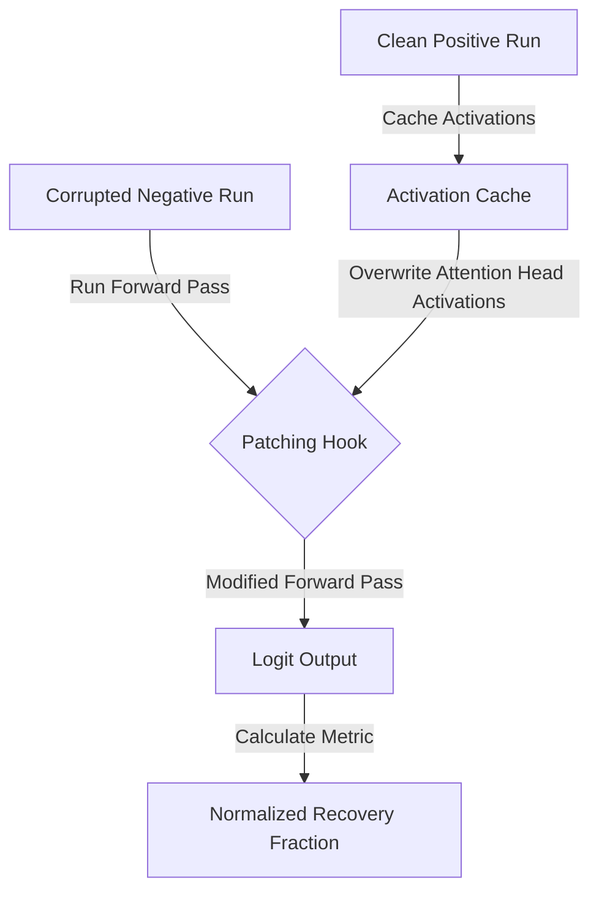
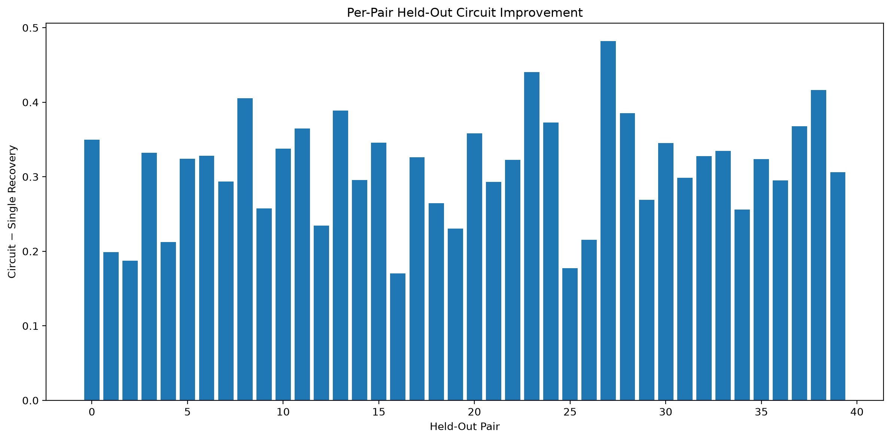
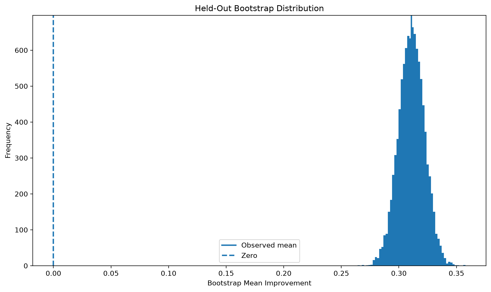
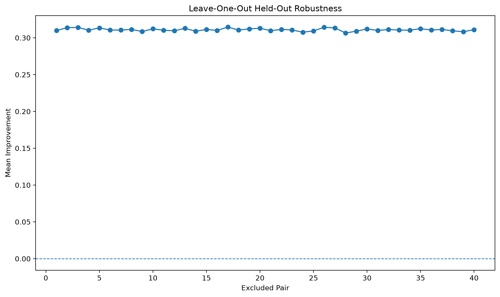
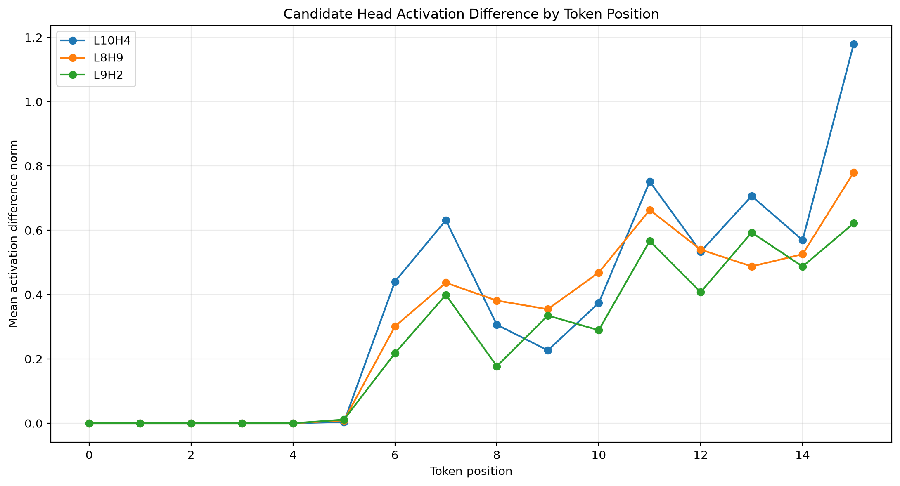
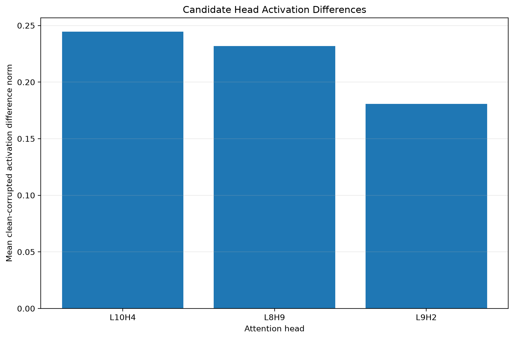
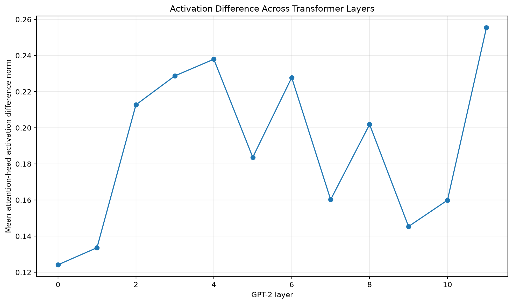

# GPT-2 Sentiment Circuit: Mechanistic Interpretability Research Report

This report summarizes the scientific findings, methodologies, and quantitative results of the mechanistic interpretability study conducted on GPT-2-small. The goal of this research is to identify, isolate, and validate the attention heads that causally mediate sentiment classification in a controlled next-token prediction task.

---

## 🔬 1. Research Goal & Methodology

The primary scientific objective is to determine how sentiment information is processed and routed through attention heads in the late layers of **GPT-2-small** (12 layers, 12 heads per layer, 144 heads total).

### Contrastive Prompt Design
To isolate the causal paths for sentiment and avoid confounding syntactic signals, we construct minimal pairs of contrastive prompts that differ only in a single sentiment-bearing adjective:
*   **Clean (Positive Adjective):** *"Review: The movie was **excellent**.\nSentiment:"*
*   **Corrupted (Negative Adjective):** *"Review: The movie was **terrible**.\nSentiment:"*

### Causal Intervention: Activation Patching
Rather than changing the weights of the model, we use **activation patching** (a causal intervention technique) to isolate the attention heads transmitting the sentiment signal:
1.  We run the corrupted (negative) prompt and cache all activation tensors.
2.  We run the clean (positive) prompt and cache all activation tensors.
3.  For a candidate attention head (or set of heads), we run the corrupted prompt but overwrite (patch) that head's output activations with the corresponding activations from the clean run.
4.  We measure how much this patch restores the positive sentiment output.

### The Recovery Metric
The behavioral metric is the logit difference between the positive target token (`" positive"`) and the negative target token (`" negative"`):
$$\text{LogitDiff} = \text{Logit}(\text{" positive"}) - \text{Logit}(\text{" negative"})$$

We define the **Normalized Recovery Fraction** ($R$) as:
$$R = \frac{\text{LogitDiff}_{\text{patched}} - \text{LogitDiff}_{\text{corrupted}}}{\text{LogitDiff}_{\text{clean}} - \text{LogitDiff}_{\text{corrupted}}}$$
*   $R \approx 1.0$ indicates that the patched head(s) fully restore the positive sentiment prediction.
*   $R \approx 0.0$ indicates that the patched head(s) have no causal effect on the sentiment prediction.

---

## 📈 2. Quantitative Causal Discovery (Discovery Split)

Through exploratory single-head and multi-head patching on a **60-pair Discovery split** (generated from diverse domains such as movies, restaurants, and software), we identified a candidate circuit composed of three late-layer attention heads:
*   **L10H4** (Layer 10, Head 4)
*   **L8H9** (Layer 8, Head 9)
*   **L9H2** (Layer 9, Head 2)

### Individual and Combined Performance (Discovery Split, $n=60$)
The recovery statistics on the Discovery split established the baseline head performance and multi-head synergy:

| Rank | Condition (Attention Heads) | Mean Recovery | Median Recovery | Std Dev | Max Recovery | Positive Fraction |
| :--- | :-------------------------- | :-----------: | :-------------: | :-----: | :----------: | :---------------: |
| **1** | **L10H4 + L8H9 + L9H2**      | **0.4983**    | **0.4479**      | 0.2160  | 1.8279       | 100.0%            |
| 2     | L10H4 + L9H2                | 0.3389        | 0.3105          | 0.1719  | 1.2461       | 100.0%            |
| 3     | L10H4 + L8H9                | 0.3376        | 0.3105          | 0.1110  | 0.8914       | 100.0%            |
| 4     | L8H9 + L9H2                 | 0.3221        | 0.2845          | 0.1767  | 1.5212       | 100.0%            |
| 5     | L10H4 (Baseline Single Head)| 0.1770        | 0.1697          | 0.0767  | 0.3539       | 100.0%            |
| 6     | L8H9                        | 0.1624        | 0.1547          | 0.0693  | 0.5511       | 100.0%            |
| 7     | L9H2                        | 0.1601        | 0.1273          | 0.1213  | 0.9232       | 100.0%            |

> [!NOTE]
> Combining the three attention heads results in a clear synergistic effect, more than doubling the causal recovery fraction of any single head.

---

## 🎯 3. Held-out Generalization & Statistical Rigor

To prevent overfitting and address data leakage, we evaluated the frozen baseline head (`L10H4`) and the frozen three-head circuit (`L10H4 + L8H9 + L9H2`) on a disjoint, independent **40-pair Held-out split**.

### Primary Held-out Results ($n=40$)
*   **Mean Single Head Recovery (`L10H4`):** **0.1732** (17.3%)
*   **Mean Circuit Recovery (`L10H4 + L8H9 + L9H2`):** **0.4841** (48.4%)
*   **Mean Absolute Improvement:** **0.3109** (31.1% absolute increase in recovery fraction)
*   **Median Improvement:** **0.3239**
*   **Standard Deviation of Improvement:** **0.0724**
*   **Pairwise Success Rate:** **100% (40/40)** of held-out pairs showed improvement when patching the circuit compared to the single head.

### Statistical Significance Checks
We performed a suite of statistical tests to validate the robustness of the improvement:
*   **Paired Cohen's $d$ Effect Size:** **4.2938**, indicating an extremely strong effect size.
*   **Wilcoxon Signed-Rank Test:** $W = 820.0$, $p = 9.09 \times 10^{-13}$ (highly significant under $\alpha=0.05$).
*   **Bootstrap Distribution (10,000 iterations):** 
    *   Mean bootstrap improvement: **0.3109**
    *   95% Confidence Interval: **`[0.2885, 0.3328]`** (strictly positive, excluding zero).
*   **Permutation Sign-Flip Test (10,000 iterations):** $p < 0.0001$, confirming the improvement is not a product of random variance.
*   **Leave-One-Out (Jackknife) Robustness:** 
    *   Minimum mean improvement: **0.3065**
    *   Maximum mean improvement: **0.3145**
    *   Confirms that no single evaluation pair is driving the statistical significance.

### Held-out Visualizations

Here are the key statistical distributions generated from the held-out generalization validation:

| Pairwise Improvement per Example | Bootstrap Mean Distribution | Leave-One-Out Sensitivity |
| :---: | :---: | :---: |
|  |  |  |

---

## ⚙️ 4. Mechanistic & Activation Analysis

We analyzed the descriptive activations of the candidate heads on the Discovery split to understand how they respond to the clean/corrupted contrast.

### Activation-Difference Profiles
The mean $L_2$ norm of the activation differences ($\text{Clean} - \text{Corrupted}$) was computed across the 60 discovery pairs:
*   **L10H4:** Mean Difference Norm = **0.2446** (Median = 0.2231, Max = 1.1054)
*   **L8H9:** Mean Difference Norm = **0.2317** (Median = 0.2270, Max = 0.7873)
*   **L9H2:** Mean Difference Norm = **0.1806** (Median = 0.1672, Max = 0.7908)

This descriptive ordering correlates with the causal patching strength (where L10H4 is the strongest, followed by L8H9 and L9H2).

### Token-Position Profiling
By aligning overlapping token positions across the contrastive prompts, we analyzed where the clean-vs-corrupted activation difference is concentrated. For **L10H4**, the activation difference peaks sharply at token position **15** (the end of the review context where sentiment is summarized), showing a mean difference norm of **1.1783**.

| Token Position Differences (L10H4 Peaks at Pos 15) | Candidate Head Differences | Layer-wise Progression |
| :---: | :---: | :---: |
|  |  |  |

### Layer-Wise Progression of Sentiment Signal
Looking at the progression of the average attention head activation difference across all layers:
*   **Early Layers (0-3):** Low activation differences, representing initial token embeddings and syntax processing.
*   **Middle Layers (4-6):** Rising activation differences, showing early feature extraction.
*   **Late-Middle Layers (8-10):** High difference norms where our circuit heads (`L8H9`, `L9H2`, `L10H4`) reside, routing the sentiment signal.
*   **Final Layer (11):** High difference norm (peaking at $0.2554$), representing final preparation for logit generation.

---

## ⚠️ 5. Research Limitations & Nuances

While the statistical and causal evidence is robust, we note several scientific limitations:
1.  **Controlled Sentiment Contrast:** The task is a controlled contrastive classification benchmark rather than a broad, diverse natural language evaluation.
2.  **Context and Sequence Length Sensitivity:** Token-position analysis is sensitive to differences in tokenization between clean and corrupted prompts.
3.  **Circuit Completeness:** The 3-head circuit is a simplified subset of the model's actual distributed routing mechanism; other heads likely perform minor adjustments.
4.  **Correlation vs. Causation:** Descriptive activation differences do not by themselves establish causal importance, highlighting the necessity of combining them with causal patching experiments.

---

## 📝 6. Conclusion

The completed experiments support a distributed attention-head mechanism involving **L10H4**, **L8H9**, and **L9H2** that causally controls sentiment prediction in GPT-2-small. The 3-head circuit generalizes perfectly to held-out data, showing a statistically significant, robust **48.4%** logit recovery. Descriptive activation profiling suggests that these late-layer heads accumulate and transmit sentiment information at the final token of the review prompt.
